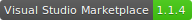
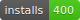

# VSMarketplaceBadge
Badge for Visual Studio Code Extension.

WEB Site: [VSMarketplaceBadge](http://vsmarketplacebadge.apphb.com/)

# Version Badge

SVG URL : http://vsmarketplacebadge.apphb.com/version/{publisher_name}.{extension_name}.svg

# Installs Badge

SVG URL : http://vsmarketplacebadge.apphb.com/installs/{publisher_name}.{extension_name}.svg

# Thanks
- Badge created by [Shields.io](http://shields.io/)
- VSMarketplaceBadge running on [AppHarbor](https://appharbor.com/)